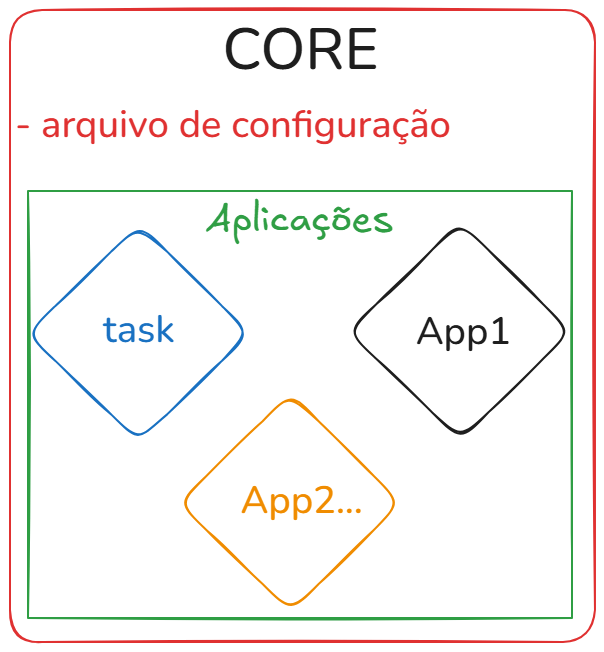

- Cria nosso ambiente virtual

```bash
python -m venv .venv
```

- Ativar nosso ambiente virtual no Windows, caso esteja usando o Linux, use `.venv/bin/activate`

```bash
.venv\Scripts\activate
```

em seguida, aparece `(.venv)` no seu terminal

- Cria um arquivo com as bibliotecas necessárias de um projeto

```bash
pip freeze > requirements.txt
```

- Instala das dependências do Django

```bash
pip install django
```

- Comando para criar um projeto no Django, o ponto (.) é utilizado para criar a pasta no mesmo nível.

```bash
django-admin startproject core .
```

```bash
python manage.py runserver
```

A figura abaixo, mostra a arquitetura de um projeto no Django uma ou mais aplicações.

[]
